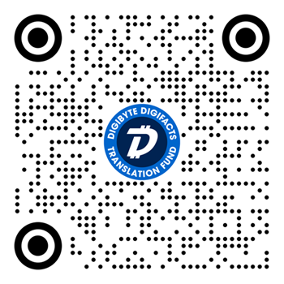

# DigiByte DigiFacts - JSON Web Service
Provides DigiByte DigiFacts in JSON format. Supports multiple languages and dynamic data.

## About DigiByte DigiFacts

DigiFacts are bitsesize facts about DigiByte, designed to be embedded in apps and websites, and shared across social media.

The original DigiFacts were created by several members of the DigiByte community back in 2021. You can see the old DigiFacts [here](https://github.com/DigiByte-Core/DigiFacts). 

These new DigiFacts are based on the originals, but have been signifcantly revised and expanded. They are now available in multiple languages and support displaying live data direct from the DigiByte blockchain. They are also now available in JSON format, so it is easy for developers to use them in their projects, to help educate their users about DigiByte. This format also ensures they can be easilly updated and expanded in the future.

## Usage

- DigiByte DigiFacts are available in multiple languages and in multiple formats - social (default), html and markdown (see below).
- For Wordpress users, there is a plugin available [here](https://github.com/DigiNode-Tools/DigiByte-DigiFacts-Wordpress-Plugin) that makes it easy to add the DigiFacts to your website.
- Query the JSON URL for the desired language and format, not more than once every 60 minutes, and cache the results locally.
- It is suggested to display a random DigiFact once per minute, or whenever the page reloads.
- **IMPORTANT: Several of the DigiFacts include dynamic data (see below) and must be updated periodically so that they remain accurate - querying the server once every hour per language should be sufficient. Please do not exceed this by making too many frequent requests to avoid stressing the server.**

For more help, visit: https://digifacts.diginode.tools/?help

| Language               | JSON URL                                                           | 
|------------------------|--------------------------------------------------------------------|
| English                | https://digifacts.diginode.tools/?lang=en&format=social             |
| Chinese (Simplified)   | https://digifacts.diginode.tools/?lang=zh&format=social             |
| Russian                | https://digifacts.diginode.tools/?lang=ru&format=social             |     
| Spanish                | https://digifacts.diginode.tools/?lang=es&format=social             |
| Korean                 | https://digifacts.diginode.tools/?lang=ko&format=social             |
| Japanese               | https://digifacts.diginode.tools/?lang=ja&format=social             |
| German                 | https://digifacts.diginode.tools/?lang=de&format=social             |
| French                 | https://digifacts.diginode.tools/?lang=fr&format=social             |
| Portuguese             | https://digifacts.diginode.tools/?lang=pt&format=social             |
| Hindi                  | https://digifacts.diginode.tools/?lang=hi&format=social             |
| Dutch                  | https://digifacts.diginode.tools/?lang=nl&format=social             |
| Italian                | https://digifacts.diginode.tools/?lang=it&format=social             |

### Requesting Diferent Formats

- ```format=social``` displays any links with the URL inline. This makes them ideal for sharing on social media.<br>e.g. ```Click here for more: https://example.com``` 
- ```format=html``` displays any links as HTML. This makes them ideal for embedding in web pages.<br>e.g. ```Click <a href="https://example.com">here</a> for more.```
- ```format=markdown``` displays any links as markdown syntax.<br>e.g. ```Click [here](https://example.com) for more.```

## Contributions

Contributions to this project from the community are actively encouraged. If you notice DigiFacts that are out of date or erroneous, please fork the repo and make a PR. You can also create an Issue [here](https://github.com/DigiNode-Tools/DigiByte-DigiFacts-JSON/issues). 

### Translations

We need volunteer native speakers to become the maintainer for each language, translating and proofreading when needed. If you can help, please join the ["DigiFact Translation Team" Telegram group](https://t.me/DigiByteDigiFacts).

Translations have been added with help from ChatGPT. If you are a native speaker, please help proofread them by clicking on the relevant language below. This will display the English DigiFacts alongside their translation, formatted so that they are easy to read. To submit improvements, please fork the repo, edit the digifacts-multilang.json file, and make a PR with your changes. Please check the JSON is valid before doing do.

If you are interested in helping translate the DigiFacts into additional languages, you can find a step-by-step Translation Guide [here](translation-guide.md) for how to do this with help from ChatGPT.

| Language (Click to Proofread)                                                              | Maintainer(s)                                        | Last Updated | Status                                              |
|-------------------------------------------------------------------------------------------|-------------------------------------------------------|--------------|-----------------------------------------------------|
| <a href="https://digifacts.diginode.tools/?lang=en&proofread">en English</a>               | [@saltedlolly](https://github.com/saltedlolly)       | 2023-11-01   | Ok                                                  |
| <a href="https://digifacts.diginode.tools/?lang=zh&proofread">zh Chinese (Simplified)</a>  |                                                      | 2023-11-01   | Needs proofreading                                  | 
| <a href="https://digifacts.diginode.tools/?lang=ru&proofread">ru Russian</a>               |                                                      | 2023-11-01   | Needs proofreading                                  | 
| <a href="https://digifacts.diginode.tools/?lang=es&proofread">es Spanish</a>               | [@rancell @kendrys](https://t.me/DigiByteDigiFacts)  | 2023-11-04   | OK                                                  | 
| <a href="https://digifacts.diginode.tools/?lang=ko&proofread">ko Korean</a>                |                                                      | 2023-11-01   | Needs proofreading                                  | 
| <a href="https://digifacts.diginode.tools/?lang=ja&proofread">ja Japanese</a>              |                                                      | 2023-11-01   | Needs proofreading                                  | 
| <a href="https://digifacts.diginode.tools/?lang=de&proofread">de German</a>                |                                                      | 2023-11-01   | Needs proofreading                                  |  
| <a href="https://digifacts.diginode.tools/?lang=fr&proofread">fr French</a>                |                                                      | 2023-11-01   | Needs proofreading                                  | 
| <a href="https://digifacts.diginode.tools/?lang=pt&proofread">pt Portuguese</a>            |                                                      | 2023-11-01   | Needs proofreading                                  | 
| <a href="https://digifacts.diginode.tools/?lang=hi&proofread">hi Hindi</a>                 |                                                      | 2023-11-01   | Needs proofreading                                  | 
| <a href="https://digifacts.diginode.tools/?lang=nl&proofread">nl Dutch</a>                 |                                                      | 2023-11-01   | Needs proofreading                                  | 
| <a href="https://digifacts.diginode.tools/?lang=it&proofread">it Italian</a>               |                                                      | 2023-11-03   | Needs proofreading                                  | 

### Adding new DigiFacts

Everybody is encouraged to help contribute new DigiFacts. If you have a DigiByte project that you wish to make the community aware of, please add a new DigiFact. Be careful to use neutral wording - no marketing or advertisng is permitted, though a single DigiFact to tell the community about your project and what it does is permitted.

Important considerations:
- New DigiFacts must be added in English first. This will then be used as the basis for the translation into other languages.
- URLs should be included both within the content text, and in the seperate URL field. This allows for easier processing. Please include only one URL per DigiFact.
- Please avoid creating DigiFacts about price - DigiFacts are for educating the community about DigiByte only.

### Using Dynamic Data in the DigiFacts

If you wish to insert dynamic data into a DigiFact, please edit the digifacts-multilang.json file and insert any of the following variables:

| Variable               | Example Content | Note                                                |
|------------------------|-----------------|-----------------------------------------------------|
| ```$blocks_tot```      | 18826496        | Displays the current number of DigiByte blocks.  |
| ```$blocks_tot_cs```   | 18,826,496      | Displays the current number of DigiByte blocks, with comma seperator. | 
| ```$blocks_tot_mil```  | 18.8            | Displays the current number of DigiByte blocks rounded to the nearest 0.1 million. |

These variable will be replaced by live data every few minutes.

## Donate to the DigiFacts Translation Fund!

Please help DigiByte reach more people around the world by donating to the DigiFacts Translation Fund:

- For every 12,500 DGB that is donated, DigiFacts will be translated into five additional languages.
- Anyone who donates 2500 DGB or more gets to choose a language to translate to. (see below)

Donate here: **dgb1qrgmuy24pj738tuc64wl30us9u8g2ywq3tclsjv**



You can monitor the current donations [here](https://digibyteblockexplorer.com/address/dgb1qrgmuy24pj738tuc64wl30us9u8g2ywq3tclsjv).

### Why Donate?

Translating the DigiFacts into a new language using ChatGPT takes time - up to 2 hours for a single language. Fortunately, the time required to translate five languages does not increase dramatically compared to doing just one. It does take longer but not that much longer - perhaps adding another hour.

I would love to see the DigiFacts translated into many more additional languages, but having already completed 12 languages in my own time, it is not possible for me to justify spending more time on this for free. Anybody is free to contribute new languages themselves.

To help accelerate the process of adding more languages, I have setup a DigiFacts Translation Fund. I pledge that for every 12,500 DGB that is donated, I will translate the DigiFacts into another five languages. I will invite the community to help choose which languages to do next. I will do my best to add them dependent on ChatGPT's ability to translate them. Anyone who donates 2500 DGB or more gets to choose one of the new language themselves. Please contact me in advance via the ["DigiFacts Translation Team" Telegram group](https://t.me/DigiByteDigiFacts) so I can check that ChatGPT can translate to your chosen language, and send me your transation ID as verifcation. In addition to helping to fund the translation of the DigiFacts, the funds raised will also help support my server and hosting costs. To be clear, we will still need native speakers to help proofread once I am done, but that is a relatively quick job.

Hopefully this fund can help accelerate the process of getting the DigiFacts translated into many more languages, while helping me to justify the time I spend working to add them. Please donate if you can.

## Projects

The following projects are known to use this service:

- [DigiNode Tools](https://diginode.tools) - DigiFacts are displayed on the DigiNode Tools website and within the DigiNode Dashboard.

## Disclaimer

These DigiFacts are provided by the DigiByte community for the DigiByte community. It is up to the community to ensure they are current and accurate. Please make a PR with any corrections.

Users should always do their own due diligence before using any of the services or products mentioned in these DigiFacts. They are provided for information purposes - mentions are not endorcements.


