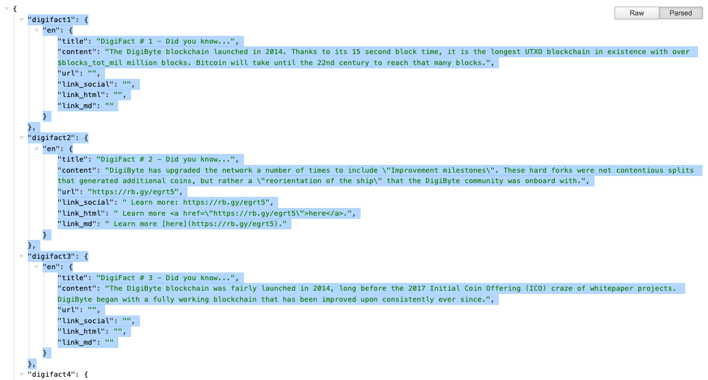
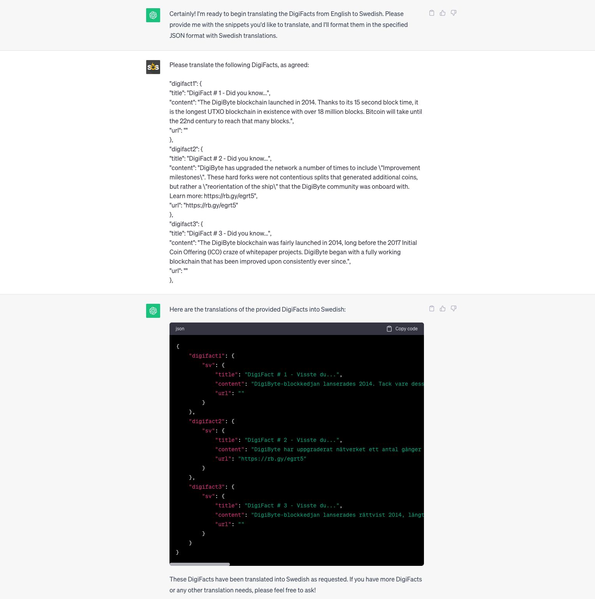
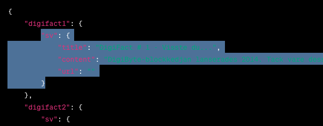
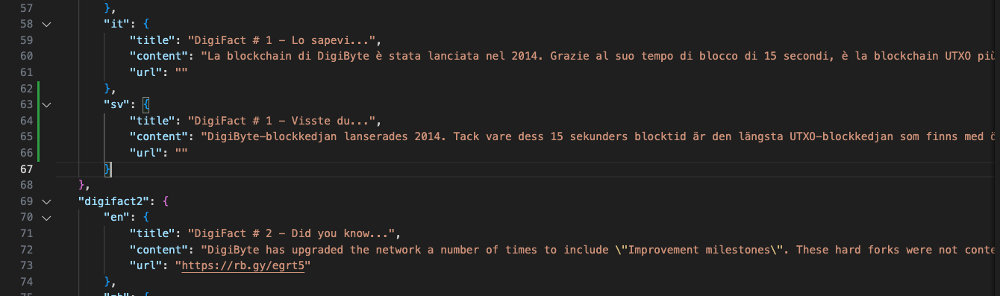
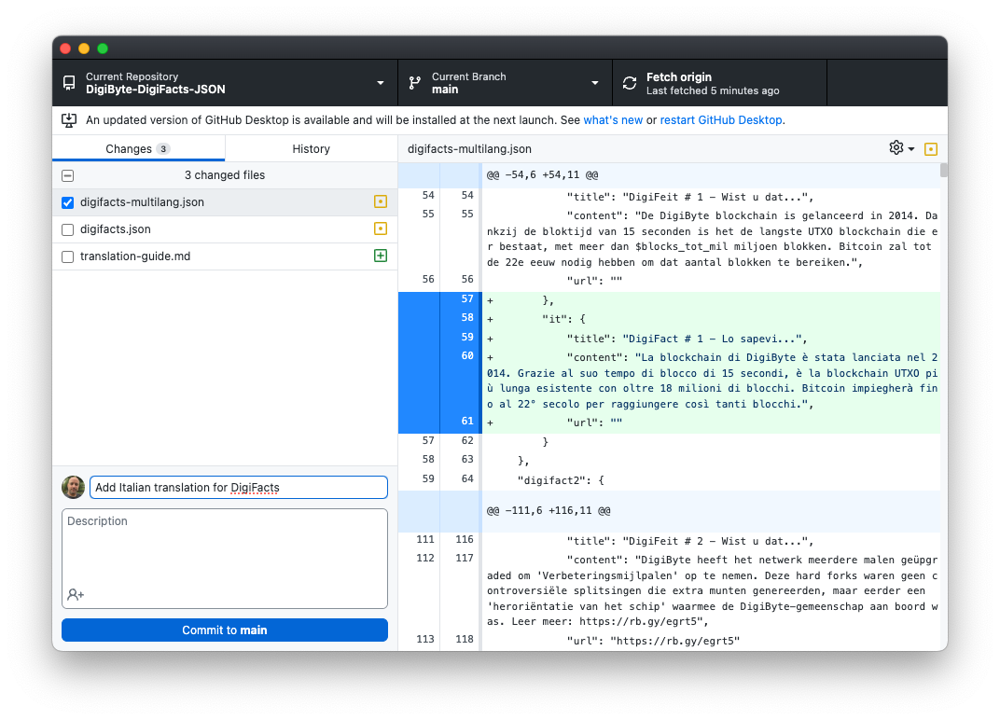
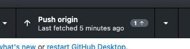

# DigiByte DigiFacts - JSON Web Service
Provides DigiByte DigiFacts in JSON format. Supports multiple languages and dynamic data.

## Translation Guide for Adding a New Language

This guide will show you how to translate all the DigiFacts into a new language with the help of ChatGPT.

This is not the only way to achieve this, but I found this method works well and helps you complete the task relatively quickly.

## Step 1. Fork the GitHub Repo and clone to your local machine

- Go to the [here](https://github.com/saltedlolly/DigiByte-DigiFacts-JSON)] and click 'Fork' in the top right.
- Clone the forked repo to your local machine. You can do this using [GitHub Desktop](https://desktop.github.com/)

## Step 2. Setup Visual Studio Code

- Install [Visual Studio Code](https://code.visualstudio.com/) if it is not already installed.
- Install the ['Prettify JSON' extension for VS Code](https://marketplace.visualstudio.com/items?itemName=mohsen1.prettify-json). This will reformat and tidy the DigiFacts JSON file before you make your pull request.

## Step 3. Setup your workspace to do the translation

For this task I highly recommend installing the [JSON Formatter](https://chrome.google.com/webstore/detail/json-formatter/bcjindcccaagfpapjjmafapmmgkkhgoa) extension got Google Chrome. It formats the JSON nicely on the screen and makes it easier to read.

- In one browser window open the [English version of this DigiFacts](https://digifacts.digibyte.help/). This is what we will be translating from.
- In a second brower window open ChatGPT. You want to use GPT-3.5 as it is much faster for this task.
- In VS Code, open the digifacts-multilang.json from the repo

## Step 4. Train ChatGPT on how to translate the DigiFacts

At the GPT-3.5 prompt paste the following:

```
I need your help translating some snippets of json code containing numbered DigiFacts - facts about DigiByte. They will be translated from English to the language I specify. I will be providing you with one or more numbered DigiFacts as a snippet of JSON code like this:

"digifact1": {
"title": "DigiFact # 1 - Did you know...",
"content": "The DigiByte blockchain launched in 2014. Thanks to its 15 second block time, it is the longest UTXO blockchain in existence with over 18 million blocks. Bitcoin will take until the 22nd century to reach that many blocks.",
"url": ""
},
"digifact2": {
"title": "DigiFact # 2 - Did you know...",
"content": "DigiByte has upgraded the network a number of times to include \"Improvement milestones\". These hard forks were not contentious splits that generated additional coins, but rather a \"reorientation of the ship\" that the DigiByte community was onboard with. Learn more: https://rb.gy/egrt5",
"url": "https://rb.gy/egrt5"
},
"digifact3": {
"title": "DigiFact # 3 - Did you know...",
"content": "The DigiByte blockchain was fairly launched in 2014, long before the 2017 Initial Coin Offering (ICO) craze of whitepaper projects. DigiByte began with a fully working blockchain that has been improved upon consistently ever since.",
"url": ""
},

Based on the input, I want you to translate them into the folliwing format. In this example, I am using Italian. Here is an example of the output:

"digifact1": {
    "it": {
        "title": "DigiFact # 1 - Lo sapevi...",
        "content": "La blockchain di DigiByte è stata lanciata nel 2014. Grazie al suo tempo di blocco di 15 secondi, è la blockchain UTXO più lunga esistente con oltre 18 milioni di blocchi. Bitcoin impiegherà fino al 22° secolo per raggiungere così tanti blocchi.",
        "url": ""
    }
},
"digifact2": {
    "it": {
        "title": "DigiFact # 2 - Lo sapevi...",
        "content": "DigiByte ha aggiornato la rete diverse volte per includere 'Pietre miliari di miglioramento'. Queste hard fork non sono state divisioni controverse che hanno generato monete aggiuntive, ma piuttosto una 'riorientazione della nave' alla quale la comunità di DigiByte ha aderito. Scopri di più: https://rb.gy/egrt5",
        "url": "https://rb.gy/egrt5"
    }
},
"digifact3": {
    "it": {
        "title": "DigiFact # 3 - Lo sapevi...",
        "content": "La blockchain di DigiByte è stata lanciata in modo equo nel 2014, molto prima della febbre delle Initial Coin Offering (ICO) del 2017 dei progetti whitepaper. DigiByte è iniziato con una blockchain perfettamente funzionante che è stata costantemente migliorata da allora.",
        "url": ""
    }
},

I will be providing you with batches of DigiFacts like these to translate. Please translate them into the language I specify, giving the result as a json snippet in the format demonstrated above. Please confirm you have understood my request.

```

Press Enter and it should hopefully confirm it has understood your instructions.

Now specify the language you are translating to. If you were tranlating to Swedish, you would enter:

```
I want you to translate from English to Swedish. Are you ready to begin?
```
Make sure that ChatGPT has understood your request, providing further instructions if necessary.

## Step 5. Translate the DigiFacts

It is best to tranlate the DigiFacts in batches. For this example, I will do it in batches of three but in practice it should be able to cope with batches of 10 without any problem.

For the DigiFacts website, select and copy your first batch of DigiFacts:



Back in the ChatGPT Window enter:

```
Please translate the following DigiFacts, as agreed:
```
Beneath this paste in the DigiFacts and press enter. It will then hopefully translate the DigiFacts like below:



Once you have the translation, select the snippet for each DigiFact and paste it beneath the other tanslations in the digifacts-multilang.json file, matching the existing formatting.

Here is an example for digifact1. Select and copy the snippet:



Paste it below the other translations for digifact1:



Be sure to add a comma after the precending language. Check the formatting against other DigiFacts to make sure it is the same.

Repeat this process with the other DiigFacts, translating additional batches when required. This may seem time consuming but once you find a rhythm you should be able to do the entire batch in an hour or so. Save frequently!

## Step 6. Prettify the finished JSON file

Make sure you are not missing any commas in your JSON, and that everything is formatted correctly.

Press Shift-Cmd-P (Mac) or Shift-Ctrl-P (Win) to run a command. Search for 'Prettify JSON' and press enter. This should reformat and correctly indent your JSON file. If it does not, then there may be an error in your code - double-check you have inputted all the language snippets correctly with commas and quotation marks in the correct places.

Save your file when done.

## Step 7. Push your changes to Github

Using Github Desktop, write a description for your change, and click "Commit to Main"



Then click "Push Origin" to push your change up to Github.



## Step 8. Make a 'Pull Request' (PR) back to the main DigiFacts repo

Return to your forked DigiFact repo on the Github website.

Click the 'Contribute' button, and then "Open Pull Request".

Enter a title (e.g. "Add Swedish translation") and a description if needed.

Click "Create Pull Request" when done.

This will push your changes upstream to the main repo, so they can be merged.


